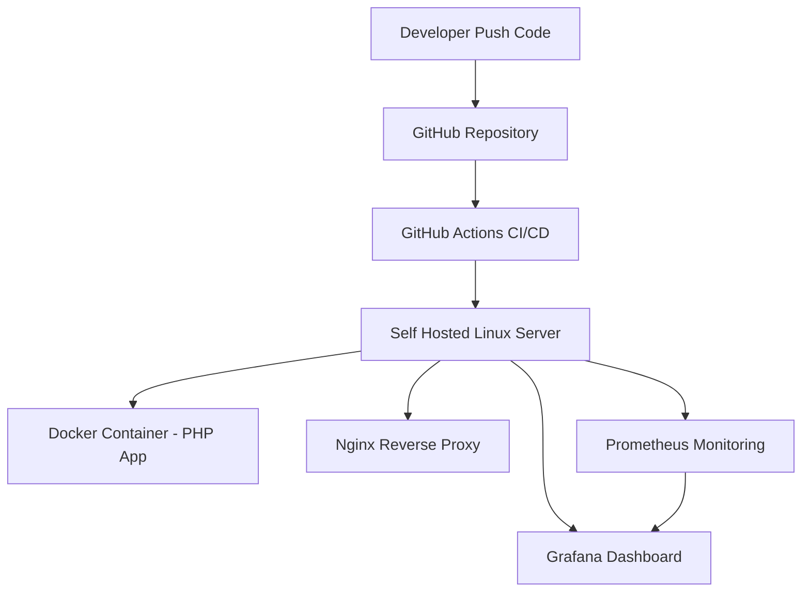

# PHP Docker CI/CD Lab

A simple PHP web application deployed using containerization and an automated CI/CD pipeline in a self-hosted Linux server environment.

This project demonstrates how a basic PHP application can be integrated with modern DevOps practices including containerization, automated deployment, and monitoring.

---

## Features

* User authentication (login system)
* Simple dashboard
* REST API endpoints
* Containerized application using Docker
* Automated deployment using GitHub Actions
* Monitoring with Prometheus and Grafana

---

## Tech Stack

* PHP (Native)
* Docker
* Nginx
* GitHub Actions
* Prometheus
* Grafana

---

## Architecture



---

## Project Structure

```
ci-project
│
├── .github/workflows/     # CI/CD pipeline
├── nginx/                 # Nginx configuration
│   └── default.conf
│
├── src/                   # PHP application source code
│   ├── api/
│   ├── assets/
│   └── ...
│
├── docker-compose.yml     # Docker services configuration
├── Dockerfile             # PHP container image
├── .env.example           # Environment variables template
└── README.md
```

---

## Local Development

Clone the repository

```
git clone https://github.com/Dans9881/php-docker-ci-cd-lab
```

Navigate to the project directory

```
cd php-docker-ci-cd-lab
```

Create environment variables

```
cp .env.example .env
```

Run the containers

```
docker compose up -d
```

The application will be available via the configured reverse proxy.

---

## Monitoring

Application and container metrics are collected using **Prometheus** and visualized through **Grafana** dashboards.

---

## Notes

This project was built as a personal lab environment to practice:

* Backend development with PHP
* Containerization with Docker
* CI/CD automation using GitHub Actions
* Infrastructure monitoring with Prometheus and Grafana

---

## License

This project is intended for learning and experimentation purposes.