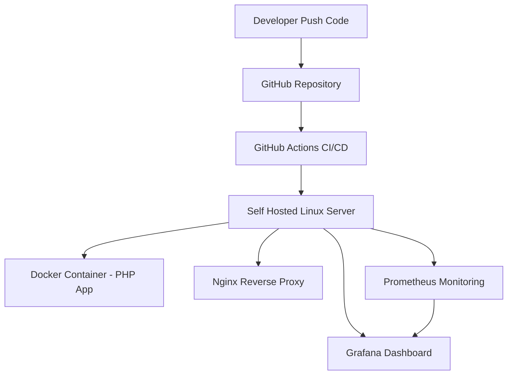

# PHP Docker CI/CD Lab

A simple PHP web application deployed using containerization and CI/CD pipeline in a self-hosted Linux server environment.

## Features
- User authentication (login system)
- Simple dashboard
- REST API endpoint
- Automatic deployment using CI/CD pipeline

## Tech Stack
- PHP (Native)
- Docker
- Nginx
- GitHub Actions
- Prometheus
- Grafana

## Architecture

## Local Development

Clone repository

git clone https://github.com/Dans9881/php-docker-ci-cd-lab

Run locally

docker compose up -d

## Notes
This project was built as a personal lab environment to practice backend development, containerization, CI/CD automation, and monitoring infrastructure.
